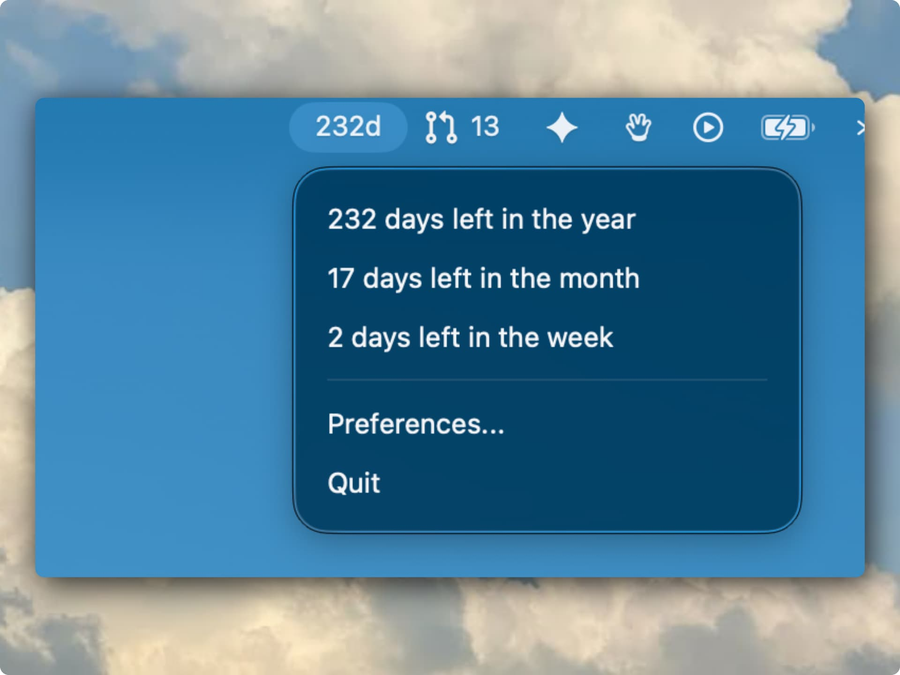

<div align="center">

# Days Left

A minimal macOS menu bar utility that shows exactly how many days remain in the year, month, and week.

<p align="center">
  
</p>

<p>
  <a href="../../releases/latest"><strong>Download</strong></a> ·
  <a href="#features">Features</a> ·
  <a href="#install">Install</a> ·
  <a href="#development">Development</a>
</p>

<p>
  
  
  
</p>

</div>

---

## Features

- **Always Visible** — Days remaining displayed directly in your menu bar (e.g., "232d")
- **Detailed Breakdown** — Click to reveal year, month, and week remaining
- **Auto Refresh** — Updates at midnight automatically
- **Sleep Aware** — Recalculates immediately after sleep/wake
- **Launch at Login** — Optional, enabled by default
- **Zero Distractions** — No Dock icon, no notifications, no sounds

## Install

1. Download the latest `DaysLeft-v1.0.0.dmg` from [Releases](../../releases/latest)
2. Open the DMG and drag **Days Left** to Applications
3. Launch from Applications

> **Note:** The app is not signed with an Apple Developer certificate. On first launch, right-click the app → **Open** to bypass Gatekeeper.

## Requirements

- macOS 13 Ventura or later
- Apple Silicon or Intel Mac

## Development

### Prerequisites

- Xcode 16 or later
- macOS 13.0 SDK

### Build

```bash
make build
```

### Test

```bash
make test
```

### Create Release DMG

```bash
make dmg
```

## Architecture

```
app/         Entry point with MenuBarExtra
state/       Observable app state (days-left-state)
views/       SwiftUI views (popover, settings)
services/    Business logic (date calc, refresh, login)
models/      Data models (date-info)
utilities/   Helpers & formatters
resources/   Assets & config
```

## Tech Stack

- Swift 6 with strict concurrency
- SwiftUI MenuBarExtra
- ObservableObject for state management
- SMAppService for launch at login
- Timer + NSWorkspace for refresh
- XCTest for unit testing

## License

MIT

## Acknowledgments

- Inspired by Sindre Sorhus's menu bar utilities
- Architecture references: BuildBar, UpNext
